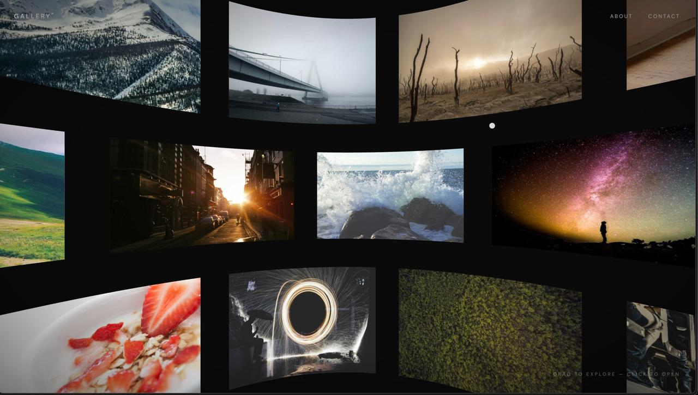

# Gallery®

A phantom.land-inspired spherical project gallery — drag to look around the inside of a sphere of curved image tiles, hover to reveal project titles, click to zoom into a project's detail page.



## Stack

- **Next.js 16** (App Router, Turbopack)
- **Three.js** — sphere of curved `SphereGeometry` tiles, `BackSide` rendering from inside the sphere
- **GSAP** — lenis-style lerped drag/momentum, hover scale & color tweens, click-to-zoom page transitions
- **Tailwind CSS v4**

## Features

- Drag (mouse or touch) to rotate around the sphere, with momentum and idle auto-drift
- Hover a tile to reveal its title, category, and year
- Click a tile to zoom in and open its dedicated project page
- 50 unique projects, each with its own image, generated as static pages at build time

## Getting started

```bash
npm install
npm run dev
```

Open [http://localhost:3000](http://localhost:3000) — the root redirects straight to `/gallery`.

## Project structure

- `components/gallery/SphereGallery.tsx` — the Three.js scene, drag/hover/click logic
- `components/gallery/ProjectDetail.tsx` — project detail page template
- `lib/projects.ts` — project data (titles, categories, image seeds)
- `app/gallery/` — gallery route and `/gallery/[slug]` detail pages
- `app/home/` — original editorial landing page

## Deploy

Deploys cleanly to [Vercel](https://vercel.com/new).
